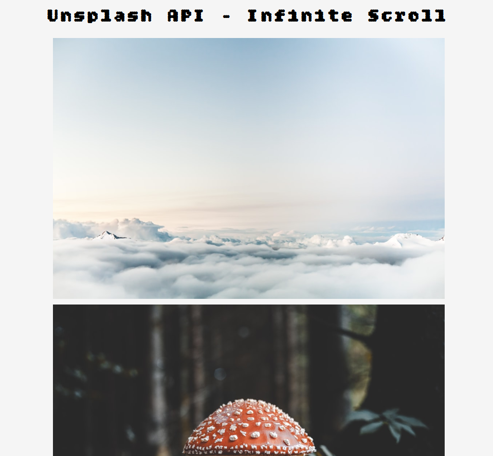

## ♾️ Infinite Scroll

A simple project that implements infinite scroll using JavaScript. As the user scrolls to the bottom of the page, new content is fetched and displayed automatically.

---

### Features

- Loads more content when the user reaches the bottom of the page
- Fetches data from a public Unsplash API
- Lightweight, responsive, and user-friendly

---
### Demo

**Live Demo**: [demo](https://abdo-rabea.github.io/infinite-scroll)
**Preview**:


---
### 🛠️ Technologies Used

- HTML5
- CSS3
- JavaScript (ES6+)
- Optional: [Unsplash API](https://unsplash.com/developers)
---
### How to Use

1. **Clone the repository:**

```bash
git clone https://github.com/abdo-rabea/infinite-scroll.git
```

2. **Open the project folder:**

```bash
cd infinite-scroll
```

3. **Open `index.html` in your browser**, or run with a local server (e.g., Live Server in VS Code).

---
### How It Works

- A list/grid of items is rendered on the page.
- When the user scrolls near the bottom:
    - A request is sent to an API to fetch more data.
    - New items are appended to the existing list.
- This continues as the user scrolls.
